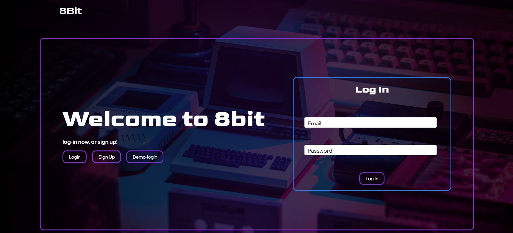
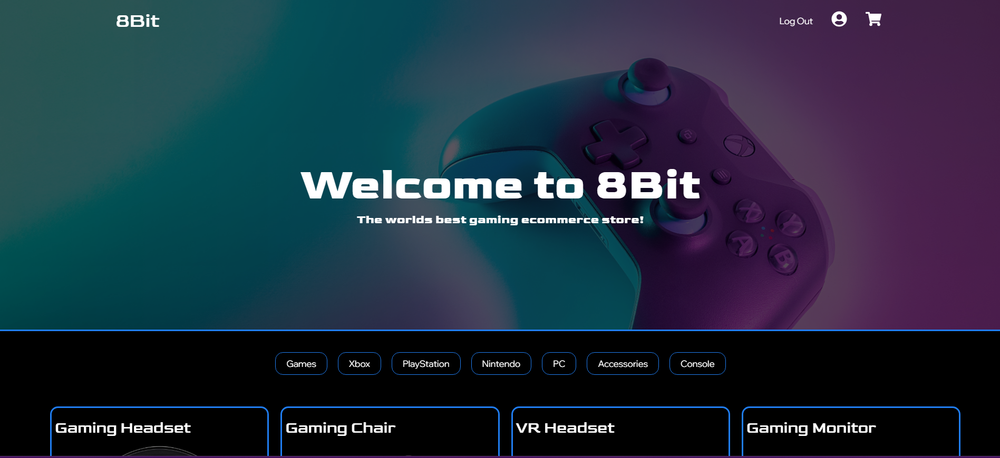
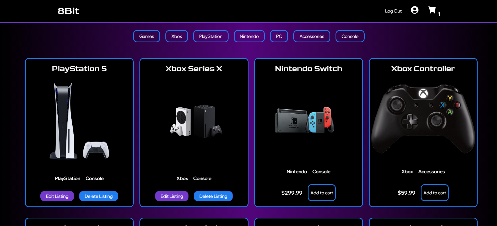
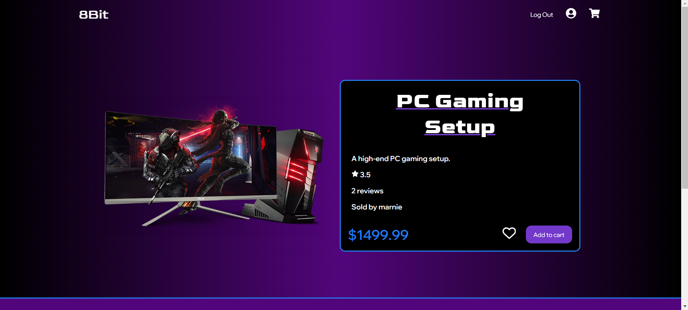
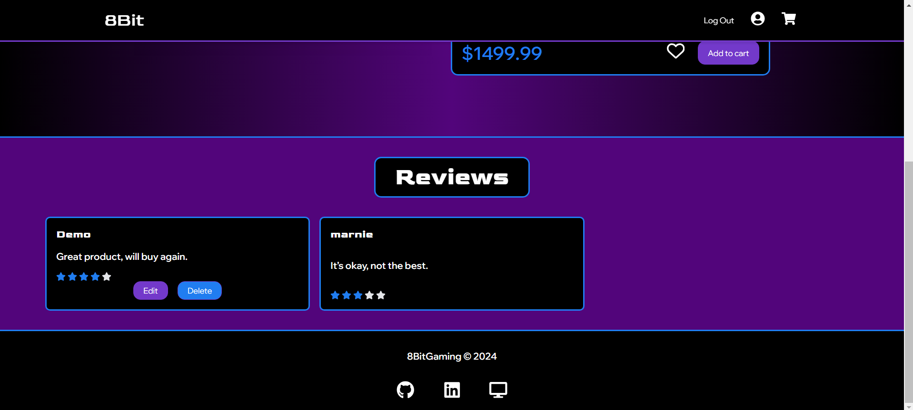
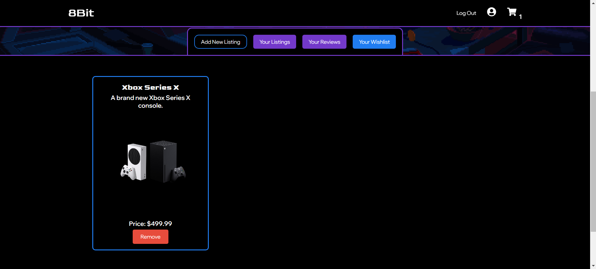

# 8Bit E-Commerce Website 🎮🛒

**8Bit** is a cutting-edge eCommerce platform designed for gamers and collectors alike. Whether you’re browsing for the latest video games or must-have accessories, 8Bit offers a seamless shopping experience. Featuring a sleek, modern interface built with performance and usability in mind, users can explore, review, and purchase their favorite products with ease.

Built with **React** and powered by **Vite** for lightning-fast performance, 8Bit combines the efficiency of modern web technologies with a passion for gaming.


[🌟Live Demo🌟](https://eight-bit-ciqo.onrender.com)

---

## Table of Contents

- [Features](#features)
- [Technologies Used](#technologies-used)
- [Setup](#setup)
- [Screenshots](#screenshots)
- [Endpoints](#endpoints)
- [Contact](#contact)

---

## Features

1. **Product Listings**  
   Browse through an extensive collection of video games and accessories, each with detailed descriptions, images, and pricing.

2. **User Reviews**  
   Check out what other gamers are saying! Each product features user reviews, complete with star ratings and comments.

3. **Wishlist Management**  
   Easily manage your wishlist to save your favorite products for later. Add or remove items with a single click.

4. **Shopping Cart**  
   An intuitive shopping cart that allows you to manage your items, update quantities, and proceed to a hassle-free checkout.

---

## Technologies Used

Here are the main technologies and tools used in building the 8Bit eCommerce platform:

### Front End


### Back End


---

## Set Up

To set up and run the project locally, follow these steps:

1. Clone the repository to your local machine:

   ```bash
   git clone https://github.com/Haydengalyeanbiz/8bit-ecommerce.git
   ```

2. Navigate to the project directory:

   ```bash
   cd 8bit-ecommerce
   ```

3. Install backend dependencies using pipenv:

   Ensure you have Pipenv installed. Then run:

   ```bash
    pipenv install -r "requirements.txt"
   ```

4. Activate the virtual environment:

   ```bash
     pipenv shell
   ```

5. Set up the Developer Server

- initialize the db
  ```bash
    Flask init
  ```
- run the migrations
  ```bash
    Flask migrate -m "descriptive
  ```
- seed the data
  ```bash
     pipenv shell
  ```

7. Install the front-end dependencies:

   - navigate to the react-vite folder

   ```bash
   cd react-vite
   ```

   - then run

   ```bash
   npm install
   ```

8. Set up environment variables:

-Create a .env file in the root directory and configure your environment variables for the backend, such as database connection details, API keys, etc.

8. In a seperate console start the back-end development server:

   ```bash
   pipenv run flask run
   ```

9. In a seperate console start the front-end development server:
   ```bash
   npm run dev
   ```

## Screenshots

### Login Page

  

### Home Page

  

### Listings

  

### Listing Page

  

### Reviews

  

### Shopping Cart

  

### Profile Page

  

### Wishlist

  

## Endpoints

### Listings

| Request                                    | Purpose                                                                            | Return Value                                                                                                  |
| ------------------------------------------ | ---------------------------------------------------------------------------------- | ------------------------------------------------------------------------------------------------------------- |
| **GET** `/api/listings/`                   | Retrieves all listings.                                                            | `[ { 'id': INT, 'user_id': INT, 'title': STRING, 'description': STRING, ... }, ... ]`                         |
| **GET** `/api/listings/user/<int:user_id>` | Retrieves all listings created by a specific user.                                 | `{ 'listings': [ { 'id': INT, 'user_id': INT, 'title': STRING, 'description': STRING, ... }, ... ] }`         |
| **GET** `/api/listings/<int:id>`           | Retrieves details of a single listing by its ID.                                   | `{ 'id': INT, 'user_id': INT, 'title': STRING, 'description': STRING, 'price': FLOAT, 'quantity': INT, ... }` |
| **POST** `/api/listings/new`               | Creates a new listing. Requires authentication.                                    | `{ 'id': INT, 'user_id': INT, 'title': STRING, 'description': STRING, 'price': FLOAT, 'quantity': INT, ... }` |
| **PUT** `/api/listings/<int:id>/edit`      | Updates an existing listing. Requires authentication and ownership of the listing. | `{ 'id': INT, 'user_id': INT, 'title': STRING, 'description': STRING, 'price': FLOAT, 'quantity': INT, ... }` |
| **DELETE** `/api/listings/<int:id>`        | Deletes an existing listing. Requires authentication and ownership of the listing. | `{ 'message': 'Listing deleted successfully' }`                                                               |

---

### Reviews

| Request                                   | Purpose                                                                          | Return Value                                                                                                      |
| ----------------------------------------- | -------------------------------------------------------------------------------- | ----------------------------------------------------------------------------------------------------------------- |
| **POST** `/api/reviews/<int:listing_id>`  | Creates a review for a specific listing. Requires authentication.                | `{ 'id': INT, 'user_id': INT, 'listing_id': INT, 'rating': INT, 'comment': STRING, ... }`                         |
| **GET** `/api/reviews/<int:listing_id>`   | Retrieves all reviews for a specific listing.                                    | `{ 'reviews': [ { 'id': INT, 'user_id': INT, 'listing_id': INT, 'rating': INT, 'comment': STRING, ... }, ... ] }` |
| **PUT** `/api/reviews/<int:review_id>`    | Updates an existing review. Requires authentication and ownership of the review. | `{ 'id': INT, 'user_id': INT, 'listing_id': INT, 'rating': INT, 'comment': STRING, ... }`                         |
| **GET** `/api/reviews/user/<int:user_id>` | Retrieves all reviews created by a specific user.                                | `{ 'reviews': [ { 'id': INT, 'user_id': INT, 'listing_id': INT, 'rating': INT, 'comment': STRING, ... }, ... ] }` |
| **DELETE** `/api/reviews/<int:review_id>` | Deletes an existing review. Requires authentication and ownership of the review. | `{ 'message': 'Review deleted' }`                                                                                 |

---

### Shopping Cart

| Request                               | Purpose                                                                               | Return Value                                                                                        |
| ------------------------------------- | ------------------------------------------------------------------------------------- | --------------------------------------------------------------------------------------------------- |
| **GET** `/api/carts/<int:id>`         | Retrieves the shopping cart for a specific user. If no cart exists, it creates one.   | `{ 'id': INT, 'user_id': INT, 'cart_items': [ { 'listing_id': INT, 'quantity': INT, ... }, ... ] }` |
| **POST** `/api/carts/add`             | Adds an item to the user's cart. If the item already exists, it updates the quantity. | `{ 'id': INT, 'user_id': INT, 'cart_items': [ { 'listing_id': INT, 'quantity': INT, ... }, ... ] }` |
| **PUT** `/api/carts/<int:item_id>`    | Updates the quantity of a specific cart item. Requires authentication and ownership.  | `{ 'id': INT, 'listing_id': INT, 'quantity': INT, ... }`                                            |
| **DELETE** `/api/carts/<int:item_id>` | Removes an item from the cart. Requires authentication and ownership.                 | `{ 'message': 'Item removed from cart' }`                                                           |
| **DELETE** `/api/carts/clear`         | Clears all items from the user's cart. Requires authentication.                       | `{ 'message': 'Cart cleared' }`                                                                     |

---

### Wishlist

| Request                                          | Purpose                                                                   | Return Value                                                     |
| ------------------------------------------------ | ------------------------------------------------------------------------- | ---------------------------------------------------------------- |
| **GET** `/api/wishlists/<int:user_id>`           | Retrieves the wishlist for a specific user. Requires authentication.      | `[ { 'id': INT, 'user_id': INT, 'listing_id': INT, ... }, ... ]` |
| **POST** `/api/wishlists/add`                    | Adds a new item to the authenticated user's wishlist.                     | `{ 'id': INT, 'user_id': INT, 'listing_id': INT, ... }`          |
| **DELETE** `/api/wishlists/<int:item_id>/delete` | Removes an item from the wishlist. Requires authentication and ownership. | `{ 'id': INT, 'message': 'Item removed from wishlist' }`         |

---

This table covers all routes for Listings, Reviews, Shopping Cart, and Wishlist with their corresponding purpose and return values. You can also view the wiki api docs for further information.

## [Wiki Api Docs](#https://github.com/Haydengalyeanbiz/8Bit-Capstone-Project/wiki/API-routes)

## Contact

- [Author](https://github.com/Haydengalyeanbiz)
- [Website](https://eight-bit-ciqo.onrender.com/)
- [Email](mailto:haydengalyeanbiz@gmail.com)
- [LinkedIn](https://www.linkedin.com/in/hayden-galyean)
